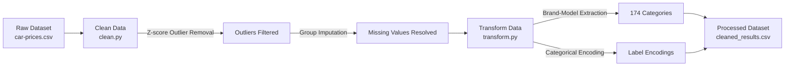

# 🚗 Used Car Price Predictor

[](https://www.python.org/)
[](https://xgboost.readthedocs.io/)
[](https://scikit-learn.org/)
[](https://streamlit.io/)
[](LICENSE)

An end-to-end Machine Learning pipeline and interactive web dashboard designed to accurately estimate the market valuation of used vehicles based on vehicle age, mileage, fuel type, transmission, ownership history, seller profile, and vehicle brand/model lines.

---

## 📌 Table of Contents

- [Overview](#-overview)
- [Key Features](#-key-features)
- [Project Architecture](#-project-architecture)
- [Data Pipeline & Preprocessing](#-data-pipeline--preprocessing)
- [Model Evaluation & Benchmarking](#-model-evaluation--benchmarking)
- [Streamlit Dashboard](#-streamlit-dashboard)
- [Installation & Quickstart](#-installation--quickstart)
- [Running Studies & Training](#-running-studies--training)
- [Authors & Acknowledgments](#-authors--acknowledgments)

---

## 📖 Overview

Predicting used car prices is challenging due to nonlinear depreciation, brand premiums, mileage degradation, and variance across seller types. This project implements a full production-style data science lifecycle:
1. **Exploratory Data Analysis (EDA)** across numerical distributions and categorical relationships.
2. **Statistical Outlier Detection & Imputation** leveraging Z-score analysis and group-wise statistics.
3. **Multi-Model Benchmarking** comparing Linear Regression, Random Forest, Support Vector Regression (SVR), and XGBoost.
4. **Hyperparameter Tuning** via grid search to find the champion model ($R^2 \approx 84.6\%$).
5. **Interactive Streamlit Web Dashboard** providing instant valuation estimates with human-friendly Indian currency denominations (₹ Lakhs & Crores).

---

## ✨ Key Features

- **Automated Data Cleaning & Imputation:**
  - Extracts `brand` and `model` from composite vehicle names.
  - Detects and trims statistical outliers using Z-score thresholding ($|Z| < 3$) on `km_driven` and `selling_price`.
  - Group-wise imputation for missing manufacturing year and fuel types based on brand and model modes/means.
  - Conditional ownership assignment for legacy vs modern vehicles.
- **Robust Feature Engineering:**
  - Encodes 174 unique vehicle brand-model families.
  - Formats categorical attributes (`fuel`, `seller_type`, `transmission`, `owner`) into clean integer codes.
- **Champion XGBoost Model:**
  - Optimized with custom learning rate, tree depth, and subsampling parameters.
  - Achieves an $R^2$ score of **0.8458** with a Mean Absolute Error (MAE) under **₹82,000**.
- **Interactive UI:**
  - Modern two-column input dashboard built with Streamlit.
  - Responsive sliders, dynamic search dropdowns, and instant model inference.

---

## 📂 Project Architecture

```plaintext
used_car_price_predictor/
├── dashboard/
│   └── app.py                      # Interactive Streamlit web application
├── data/
│   ├── models/
│   │   └── xgboost_car_price_model.pkl   # Serialized champion model
│   ├── processed/
│   │   ├── cleaned_results.csv     # Transformed & encoded dataset (3,601 records)
│   │   ├── model_metrics.csv       # Test set predictions comparison
│   │   └── optimization_results.txt# Hyperparameter tuning benchmarks
│   ├── raw/
│   │   └── car-prices.csv          # Raw vehicle dataset (4,340 records)
│   └── training/
│       └── model_predictions.csv   # Baseline model metrics (RMSE, MAE, R²)
├── src/
│   ├── data_loader/
│   │   ├── cleaned_results.py      # Loader utility for processed data
│   │   └── fetch.py                # Loader utility for raw data
│   ├── data_processing/
│   │   ├── clean.py                # Core data cleaning & outlier removal
│   │   ├── explore.py              # High-level dataset inspection
│   │   └── transform.py            # Feature transformation & category encoding
│   └── models_training/
│       ├── models_optimisation.py  # GridSearchCV hyperparameter tuning
│       ├── models_training.py      # Baseline multi-model training suite
│       ├── optimisation.py         # Grid search helper functions
│       ├── save.py                 # Final model training and serialization
│       └── training.py             # Evaluation & metrics computation
├── tests/
│   ├── data_loading/
│   │   ├── explore_raw_data_file.py
│   │   └── fetch_data.py
│   ├── data_processing/
│   │   ├── cleaning_data.py
│   │   └── transform_and_save.py
│   └── studies/                    # Individual exploratory data analysis scripts
│       ├── correlation_matrix.py
│       ├── fuel.py
│       ├── fuel_by_brand_stats.py
│       ├── km_driven.py
│       ├── owner.py
│       ├── seller_type.py
│       ├── year.py
│       ├── year_by_brand_stats.py
│       ├── zcode_after_cleaning.py
│       └── zscore.py
└── README.md
```

---

## 🔬 Data Pipeline & Preprocessing

The raw dataset contains 4,340 records with fields: `name`, `year`, `selling_price`, `km_driven`, `fuel`, `seller_type`, `transmission`, and `owner`.



### Feature Encodings

| Feature | Encoded Values |
| :--- | :--- |
| **Fuel** | `Diesel: 0`, `Petrol: 1`, `CNG: 2`, `LPG: 3`, `Electric: 4` |
| **Seller Type** | `Individual: 0`, `Dealer: 1`, `Trustmark Dealer: 2` |
| **Transmission** | `Manual: 0`, `Automatic: 1` |
| **Owner** | `Test Drive Car: 0`, `First Owner: 1`, `Second Owner: 2`, `Third Owner: 3`, `Fourth & Above: 4` |
| **Brand & Model** | Category code (`0` to `173`) indexed alphabetically |

---

## 📊 Model Evaluation & Benchmarking

Four regression algorithms were evaluated using an 80/20 train-test split (`random_state=42`).

### 1. Baseline Performance

| Model | RMSE (₹) | MAE (₹) | $R^2$ Score |
| :--- | :---: | :---: | :---: |
| **XGBoost Regressor** | **132,984.66** | **85,696.41** | **0.8303** |
| Random Forest Regressor | 151,600.02 | 99,695.75 | 0.7794 |
| Linear Regression | 218,039.02 | 157,507.04 | 0.5437 |
| Support Vector Regressor (SVR) | 333,421.11 | 234,600.84 | -0.0670 |

### 2. Hyperparameter Optimized Performance

After systematic tuning using `GridSearchCV`:

| Model | Best Parameters | Optimized RMSE (₹) | Optimized MAE (₹) | Optimized $R^2$ |
| :--- | :--- | :---: | :---: | :---: |
| 🏆 **XGBoost** | `learning_rate: 0.1, max_depth: 5, n_estimators: 300, subsample: 0.8` | **126,767.07** | **81,993.02** | **0.8458** |
| **Random Forest** | `max_depth: None, min_samples_split: 5, n_estimators: 300` | 150,027.18 | 98,304.77 | 0.7840 |
| **Linear Regression** | `fit_intercept: True, positive: False` | 218,039.02 | 157,507.04 | 0.5437 |
| **SVR** | `C: 100, gamma: 'scale', kernel: 'linear'` | 260,046.24 | 169,960.29 | 0.3510 |

---

## 🖥️ Streamlit Dashboard

The web dashboard provides an intuitive interface to valuate any vehicle in real time:

- **Left Column:** Manufacturing Year slider (1990–2024), Kilometers Driven input, and Ownership History dropdown.
- **Right Column:** Searchable Brand & Model dropdown (174 models), Fuel Type, Seller Type, and Transmission selector.
- **Output:** Instant calculated price formatted with currency separators and an Indian Lakhs/Crore denominator badge (e.g., `₹4,70,085 (~₹4.70 Lakhs)`).

To run the dashboard:

```bash
streamlit run dashboard/app.py
```

---

## 🚀 Installation & Quickstart

### Prerequisites

- Python 3.10 or higher
- Git

### 1. Clone the Repository

```bash
git clone https://github.com/lioubiarabi/used_car_price_predictor.git
cd used_car_price_predictor
```

### 2. Create and Activate Virtual Environment

**On Windows:**
```powershell
python -m venv .venv
.venv\Scripts\activate
```

**On macOS/Linux:**
```bash
python3 -m venv .venv
source .venv/bin/activate
```

### 3. Install Dependencies

```bash
pip install pandas numpy scipy scikit-learn xgboost joblib matplotlib seaborn streamlit
```

---

## ⚙️ Running Studies & Training

### Run the Data Transformation Pipeline
To generate `data/processed/cleaned_results.csv`:
```bash
python -m tests.data_processing.transform_and_save
```

### Train and Save the Champion Model
To re-train the optimized XGBoost model and save it to `data/models/`:
```bash
python -m src.models_training.save
```

### Run Model Comparison & Benchmarks
```bash
python -m src.models_training.models_training
python -m src.models_training.models_optimisation
```

### Run Exploratory Data Analysis (EDA) Studies
Explore individual feature correlations and distributions:
```bash
python -m tests.studies.correlation_matrix
python -m tests.studies.fuel
python -m tests.studies.year
python -m tests.studies.zscore
```

---

## 👤 Author

- **Arabi Lioubi** - [GitHub Profile](https://github.com/lioubiarabi) • [Email](mailto:l.loubi1886@uca.ac.ma)

---

## 📄 License

This project is licensed under the MIT License - see the LICENSE file for details.
